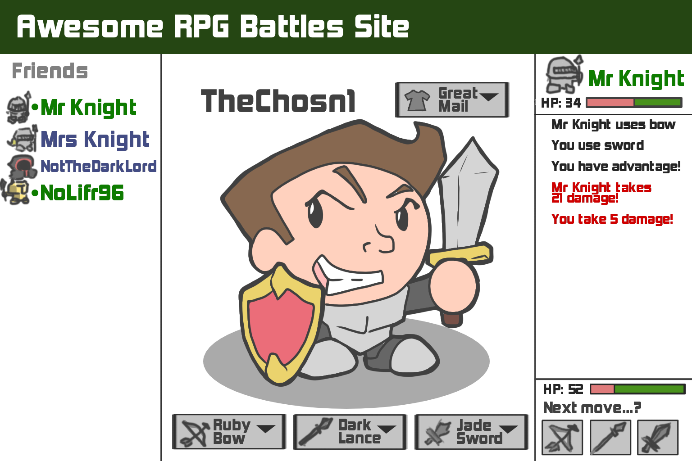

# Specification

## Elevator Pitch

It's fun to play games with friends. The competitive nature of them makes them a fun way to keep up with people and settle scores. This site will offer a competitive turn-based RPG hub where a player tries to outplay their opponent by choosing winning options and leveling up. They will be able to gather valuable weapons and experience using them to decimate their opponents in battle.

## Layout

## Key features

- Secure login over HTTPS
- Ability to choose and equip new armor and weapons
- Display of friends
- Ability to challenge friends to battles
- Toggle between friends to battle
- Choose moves and follow the events in a battle
- Win experience and new weapons

## Technologies

I am going to use the required technologies in the following ways:

- **HTML:** Structure of page. One page is for login, and one for battle.

- **CSS:** Adds styling to the page so that it has good use of whitespace and colors.

- **JavaScript:** Makes login, chooses attacks, displays the results of a turn, and makes backend calls.

- **Service:** Backend has endpoints for:
 -login
 -sending attacks
 -retrieving opponent attacks

- **DB/Login:** Store users, bow, spear, sword, and armor inventories, experience. Register and login users, with credentials.

- **WebSocket:** As players make their moves, the turn results are sent to their opponents.

- **React:** Application ported to use the React web framework.

## HTML Deliverable

For this deliverable I built out the structure of my application using HTML.

- **HTML pages:** Four HTML pages, one able to log the user in, one the page where battles will take place, one for friend list, and another for the player to manage their inventory.

- **Links:** Each page has a navbar at the top of the page for all of the other pages. The login page links to the battle page. The friend list also has a link to the battle page on each friend.

- **Text:** The battle page has a representation of text a user might see while battling, and a text representation of an HP bar. The friend page includes a checker to see how recently certain friends were active. The inventory page has a list of each armor, bow, sword, and spear the user has so that they can equip them as desired.

- **Images:** The battle page has easy icons to show the user their attack options. The friend page has an icon for each friend. The inventory page has an icon for the player.

- **DB/Login:** Input box and submit button for login. There is a temporary html page detailing the inventory and friend connections in the database, as well as where we store login information.

- **WebSocket:** There is a temporary html page detailing the sorts of information involved in each data transfer. We will update data when a user picks an attack to advance the battle, when they send a friend request, and when they accept or deny a friend request.